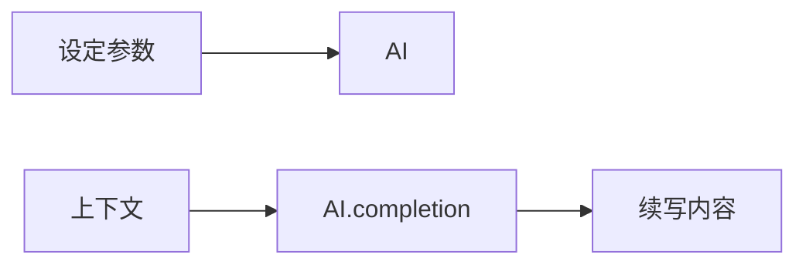
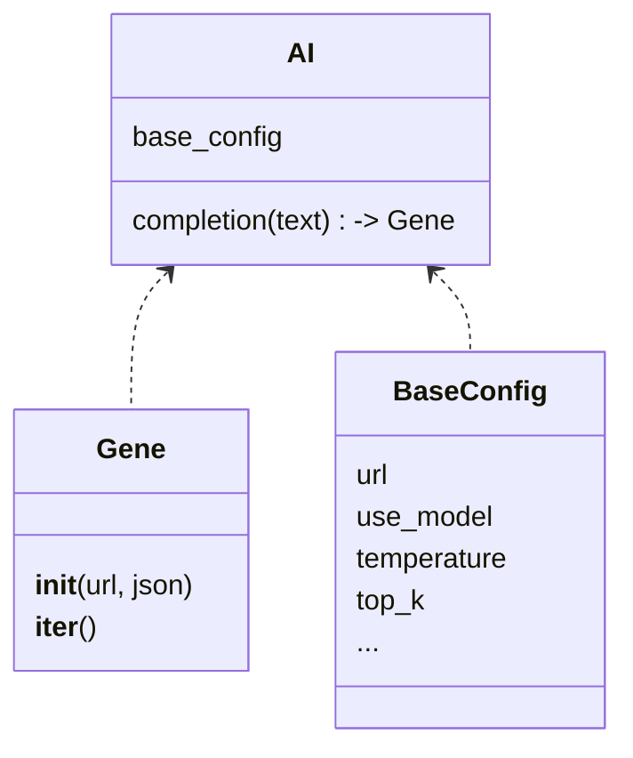
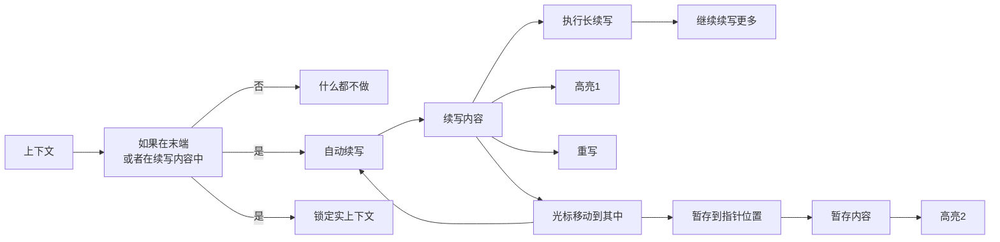
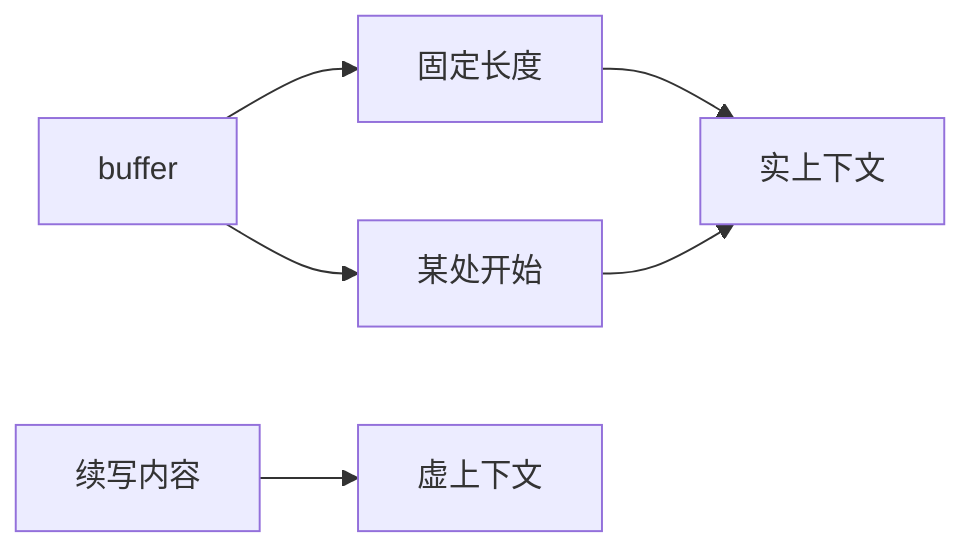

# vim-localai
用本地LLM为neovim提供加强的类
## python AI接口

#### Gene
一个生成器，从ws连接中获取词语

#### BaseConfig 
基本设置，定义了模型的基本参数

#### AI 
提供一组方法(目前只需要实现completion)用于方便使用。
## Vim操作
自动续写：

上下文：

- 进入续写内容后实上下文被固定。

## 功能：
- 自动续写: 打开/关闭自动续写功能
    - 从某处开始
    - 全文
    - 固定长度上文
- 手动续写: 手动续写某个部分
    - 从某处开始
    - 全文
    - 固定长度上文
- 显示设置: 在右边的窗口中打开AI设置的文件
- 重新生成

## TODO
- 带提示词的修改
    - 选区
- 带下文的续写
