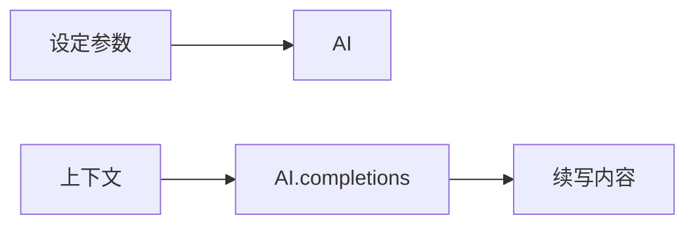
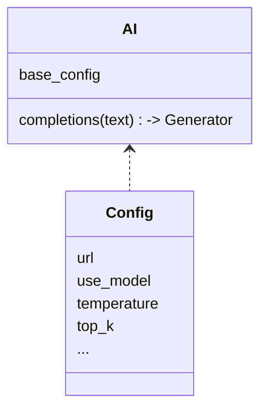

# vim-localai
用本地LLM为neovim提供加强的类

## 设置
```lua
vim.g.vim_localai_settings = {
  urls = {
    completions = "http://localhost:5000/v1/completions", -- 网址
  },
  completions = {
    max_tokens= 64,
    temperature = 0.7,
    top_p = 0.9,
    top_k = 20,
    repetition_penalty = 1.15,
  }
}
```

## python AI接口



#### Model
模型类

#### AI 
提供一组方法(目前只实现completions了)用于方便使用。

## Vim Command
## AICompletions
续写全文
## StopAICompletions
停止续写全文

## TODO
- 重新生成
- 高亮生成内容
- 遇到某些token时自动停止
