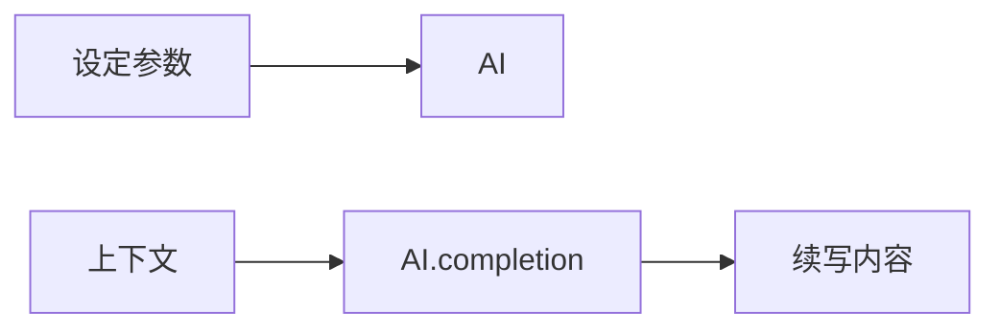
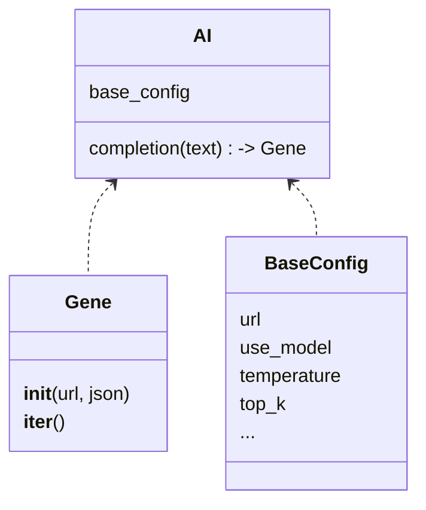
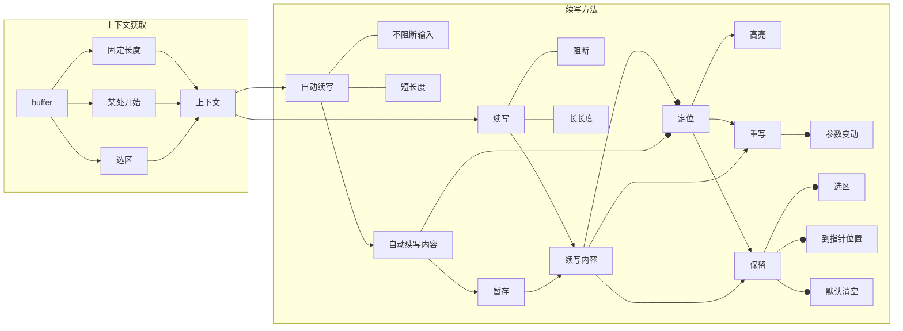

# vim-localai
用本地LLM为neovim提供加强的类
## AI接口

#### Gene
一个生成器，从ws连接中产生词语

#### BaseConfig 
基本设置，定义了模型的基本参数

#### AI 
提供一组方法(目前只需要实现completion)用于方便使用。
## Vim操作

它需要做到这些：
1. 可以进行续写与打断
    - 无选区时
        - 默认行为
    - 对选区进行续写
2. 可以方便地舍弃/切换续写的内容
    - 对续写内容的定位
    - 重写
    - 选择保留
3. 容易看见续写了什么
    - 对续写内容的定位，增加“高亮”
